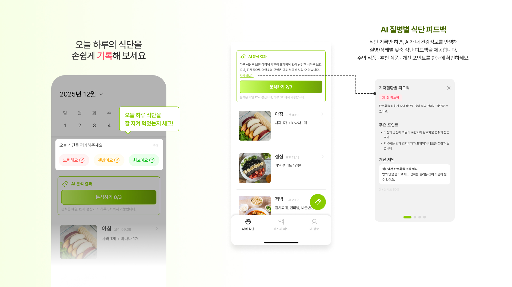
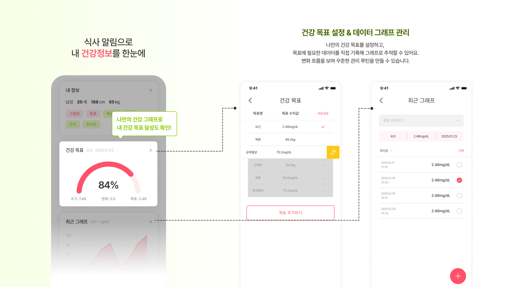
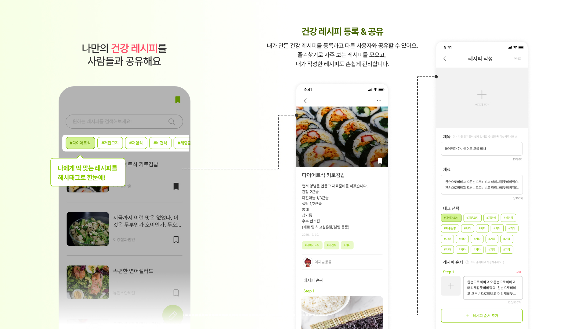
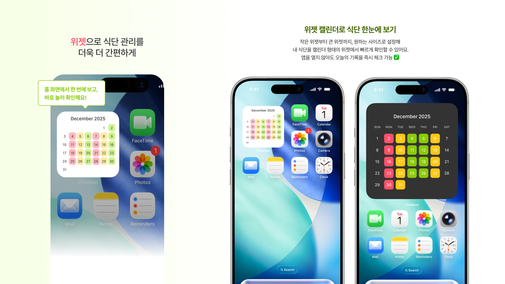

<h1 align="center">
Vitameal
</h1>

  

 

## 🔖 프로젝트 개요
### “Vitameal (비타밀)"은 건강관리를 위한 식단관리 앱 입니다.

#### "vitameal (비타밀)"은 다음과 같은 분들을 위해 탄생되었습니다.

VitaMeal은 사용자의 건강 상태와 식습관을 바탕으로 최적의 영양 상태를 유지할 수 있도록 돕는 스마트 헬스케어 플랫폼입니다. 일일 영양소 섭취량 추적, 맞춤형 비타민 추천, 그리고 식단 기록 기능을 통해 체계적인 건강 관리를 지원합니다.

목표: 개인화된 데이터를 기반으로 한 식단 분석 및 영양제 관리 서비스 제공

주요 타겟: 건강 관리에 관심이 많은 현대인, 영양제 복용을 체계적으로 하고 싶은 사용자

      

## 🎨 앱 디자인 설계

  

  

  

  

 

## 📌 주요 기능
1. AI 질병별 식단 피드백
    - 식단 기록만 하면, AI가 내 건강정보를 반영해 질병/상태별 맞춤 식단 피드백을 제공합니다.
    - 주의 식품 · 추천 식품 · 개선 포인트를 한눈에 확인하세요.
2. 건강 목표 설정 & 데이터 그래프 관리
    - 나만의 건강 목표를 설정하고, 목표에 필요한 데이터를 직접 기록해 그래프로 추적할 수 있어요.
    - 변화 흐름을 보며 꾸준한 관리 루틴을 만들 수 있습니다.
3. 건강 레시피 등록 & 공유
    - 내가 만든 건강 레시피를 등록하고 다른 사용자와 공유할 수 있어요.
    - 즐겨찾기로 자주 보는 레시피를 모으고, 내가 작성한 레시피도 손쉽게 관리합니다.
4. 위젯 캘린더로 식단 한눈에 보기
    - 작은 위젯부터 큰 위젯까지, 원하는 사이즈로 설정해 내 식단을 캘린더 형태의 위젯에서 빠르게 확인할 수 있어요.
    - 앱을 열지 않아도 오늘의 기록을 즉시 체크.

 

## 🛠️ 기술 스택

### 🏗️ Architecture & Language
| 분류 | 기술 | 상세 설명 |
| :--- | :--- | :--- |
| **Framework** | Flutter | 크로스플랫폼 프레임워크 |
| **Language** | Dart | 프로그래밍 언어 |
| **Architecture** | Clean Architecture | 의존성 역전, 도메인 중심 설계 |

### 🧩 State Management & Logic
| 분류 | 기술 | 상세 설명 |
| :--- | :--- | :--- |
| **State Management** | Riverpod | 전역 상태 관리, DI, Compile-time safety (hooks_riverpod, riverpod_annotation) |
| **Hooks** | flutter_hooks | 위젯 생명주기 관리 및 로직 간결화 |
| **Data Modeling** | freezed | Immutable 데이터 모델링 및 Union types |
| **Serialization** | json_serializable | API/DB 데이터 직렬화 자동화 |

### 🌐 Backend & Database
| 분류 | 기술 | 상세 설명 |
| :--- | :--- | :--- |
| **Backend (BaaS)** | Supabase | Auth(OAuth), PostgreSQL, Storage, RPC 서버 로직 |
| **Local DB** | Drift (SQLite) | 로컬 SQLite DB 추상화 및 오프라인 데이터 관리 |
| **Storage** | shared_preferences | 언어 설정 및 간단한 사용자 설정 저장 |
| **File System** | path_provider | 로컬 파일 경로 관리 및 sqlite3_flutter_libs 지원 |

### 📍 Navigation & Localization
| 분류 | 기술 | 상세 설명 |
| :--- | :--- | :--- |
| **Routing** | go_router | 선언형 라우팅 및 인증 상태 기반 화면 분기 |
| **Localization** | intl / ARB | ARB 기반 다국어 지원 (앱 재시작 없이 즉시 반영) |
| **System** | url_launcher | 외부 링크 및 출처 페이지 연결 |

### 🔔 Firebase & Infrastructure
| 분류 | 기술 | 상세 설명 |
| :--- | :--- | :--- |
| **Push Notification** | firebase_messaging | FCM 푸시 알림 (Foreground / Background) |
| **Local Notify** | flutter_local_notifications | 로컬 알림 처리 |
| **Analytics** | Firebase Analytics | 사용자 행동 분석 및 이벤트 트래킹 |
| **Crash Report** | Firebase Crashlytics | 런타임 크래시 수집 및 분석 |

### 🎨 UI/UX & Media
| 분류 | 기술 | 상세 설명 |
| :--- | :--- | :--- |
| **Visualization** | fl_chart | 건강 데이터 시각화를 위한 그래프 |
| **Calendar** | table_calendar | 캘린더 UI 구현 |
| **Image Process** | image_picker / compress | 이미지 선택 및 업로드 전 압축 최적화 |
| **Image Cache** | cached_network_image | 네트워크 이미지 캐싱 성능 개선 |
| **Icons** | flutter_svg / phosphor_flutter | SVG 및 포스포 아이콘 라이브러리 |
| **Components** | dropdown_button2 / slidable | 커스텀 드롭다운 및 스와이프 액션 UI |
| **Anti-Spam** | tap_debouncer | 버튼 중복 클릭 방지 |

### 🤖 AI & Others
| 분류 | 기술 | 상세 설명 |
| :--- | :--- | :--- |
| **AI** | OpenAI API | 기저질환 반영 AI 식단 분석 |
| **Social Auth** | Kakao SDK / Web Auth 2 | 카카오 로그인 및 OAuth 인증 지원 |
| **Home Widget** | home_widget | iOS / Android 홈 위젯 데이터 연동 |
| **Environment** | flutter_dotenv | 환경변수(.env) 관리 |
| **Build Tool** | build_runner | 코드 생성 자동화 및 flutter_native_splash |

 

## 📖 라이브러리

<pre>
### Dependencies
  flutter_hooks: ^0.21.3+1
  freezed_annotation: ^3.1.0
  hooks_riverpod: ^3.0.3
  json_annotation: ^4.9.0
  riverpod_annotation: ^3.0.3
  flutter_riverpod: ^3.0.3
  build_runner: ^2.7.1
  go_router: ^17.0.0
  intl: ^0.20.2
  image_picker: ^1.2.1
  supabase_flutter: ^2.12.0
  tap_debouncer: ^2.2.0
  table_calendar: ^3.2.0
  fl_chart: ^1.1.1
  shared_preferences: ^2.5.4
  flutter_image_compress: ^2.4.0
  connectivity_plus: ^7.0.0
  drift: ^2.25.0
  sqlite3_flutter_libs: ^0.5.41
  path_provider: ^2.1.5
  path: ^1.9.1
  uuid: ^4.5.2
  flutter_slidable: ^4.0.3
  firebase_core: ^4.3.0
  firebase_messaging: ^16.1.0
  flutter_local_notifications: ^19.5.0
  flutter_svg: ^2.2.3
  dropdown_button2: ^2.3.9
  home_widget: ^0.8.1
  phosphor_flutter: ^2.1.0
  cached_network_image: ^3.4.1
  firebase_crashlytics: ^5.0.6
  firebase_analytics: ^12.1.0
  url_launcher: ^6.3.2
  kakao_flutter_sdk_user: ^1.10.0
  flutter_dotenv: ^6.0.0
  flutter_web_auth_2: ^5.0.0

### dev_dependencies
  flutter_test:
    sdk: flutter
  freezed: ^3.2.3
  flutter_lints: ^5.0.0
  json_serializable: ^6.11.2
  riverpod_generator: ^3.0.3
  change_app_package_name: ^1.5.0
  drift_dev: ^2.25.0
  flutter_native_splash: ^2.4.7
</pre>

 

## 📂 프로젝트 구조
<pre>
vitameal/
├── .vscode/
│   └── extensions.json
├── android/
│   ├── app/
│   │   ├── google-services.json
│   │   ├── build.gradle.kts
│   │   └── src/main/kotlin/com/alldayproject/vitameal/
│   │       ├── MainActivity.kt
│   │       └── widget/ (Native Widget 구현부)
│   └── ... (안드로이드 리소스 및 설정 파일들)
├── ios/
│   ├── Runner/
│   │   ├── AppDelegate.swift
│   │   ├── GoogleService-Info.plist
│   │   └── Info.plist
│   ├── VitamealWidget/ (iOS Widget 구현부)
│   └── Podfile
├── assets/
│   └── images/ (앱 로고, 인트로, 스플래시 이미지 등)
├── lib/
│   ├── main.dart
│   ├── core/ (공통 모듈 및 설정)
│   │   ├── config/ (Router, Firebase 설정)
│   │   ├── di/ (Riverpod Provider)
│   │   ├── platform/ (Native Bridge)
│   │   ├── service/ (FCM, Analytics, Notification)
│   │   ├── theme/ (App Theme, Colors)
│   │   └── util/ (Common Utils)
│   ├── data/ (데이터 계층)
│   │   ├── data_source/ (Remote/Local Data Source)
│   │   ├── database/ (Drift DB & DAO)
│   │   ├── dto/ (Data Transfer Objects & Freezed)
│   │   ├── mapper/ (DTO <-> Entity 매퍼)
│   │   ├── repository_impl/ (Repository 구현체)
│   │   ├── service/ (Sync, Widget Service)
│   │   └── util/ (Image Compressor 등)
│   ├── domain/ (비즈니스 로직 계층)
│   │   ├── entity/ (Domain Models)
│   │   ├── enum/ (Common Enums)
│   │   ├── repository/ (Repository 인터페이스)
│   │   └── usecase/ (Login, Logout Usecases)
│   └── presentation/ (UI 계층)
│       ├── auth/ (로그인 및 소셜 인증)
│       ├── goal/ (목표 설정 및 관리)
│       ├── home/ (메인 홈 화면)
│       ├── info/ (분석 그래프 및 정보)
│       ├── intro/ (온보딩/인트로 화면)
│       ├── meal_calendar/ (식단 달력 및 AI 분석 결과)
│       ├── meal_editor/ (식단 추가/수정)
│       ├── notification/ (알림 목록 및 설정)
│       ├── onboarding/ (사용자 정보 입력 단계)
│       ├── post/ (게시글 및 레시피 공유)
│       ├── setting/ (앱 설정 및 메뉴)
│       ├── splash/ (스플래시 화면)
│       ├── ui_provider/ (UI 전용 Riverpod Providers)
│       ├── util/ (UI Utils & Snackbar)
│       └── widget/ (공통 UI 컴포넌트 - 버튼, 다이얼로그 등)
├── supabase/
│   ├── functions/ (Edge Functions)
│   │   ├── analyze-meals/ (AI 식단 분석)
│   │   └── send_fcm_notification/ (알림 발송)
│   └── config.toml
├── .env (환경 변수)
├── analysis_options.yaml (린트 설정)
├── firebase.json (Firebase 설정)
├── flutter_launcher_icons.yaml (아이콘 설정)
├── pubspec.yaml (의존성 관리)
└── README.md
</pre>

 

## 📝 커밋 컨벤션

- feat: 새로운 기능 추가
- fix: 버그 수정
- docs: 문서 수정
- style: 코드 포맷팅, 세미콜론 누락 등
- refactor: 코드 리팩터링
- design: 사용자 UI 디자인 변경
- test: 테스트 코드 추가
- chore: 빌드, 패키지 매니저 등 환경 설정
